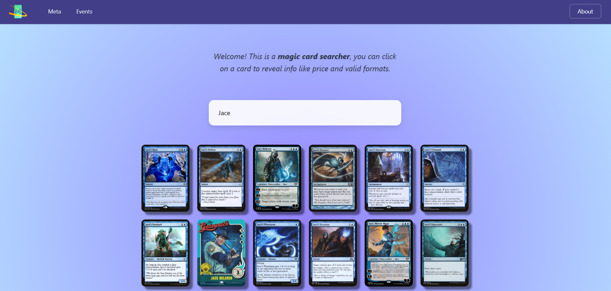
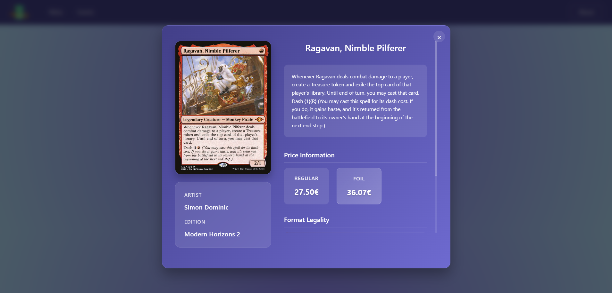

# A magic searcher
This a practice project using React.js and a wrapper for the  [Scryfall Api](https://scryfall.com/docs/api)
by [crookedneighbor](https://github.com/crookedneighbor/scryfall-client). Search for cards by name to obtain info like prices, formats, printings, etc.
I also use my mtg-api to scrap tournament and deck data from MTGTop8.

